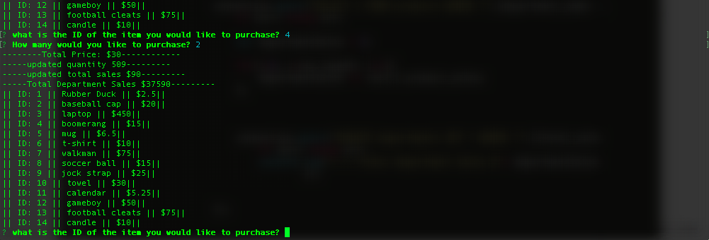
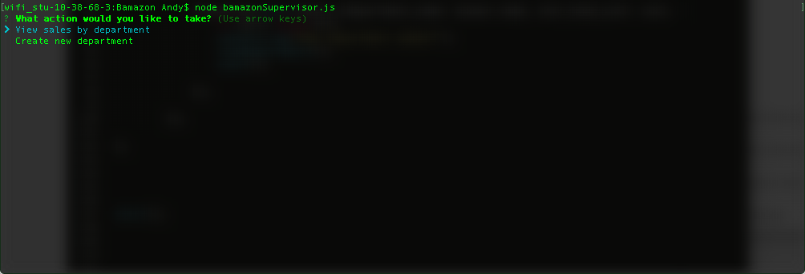
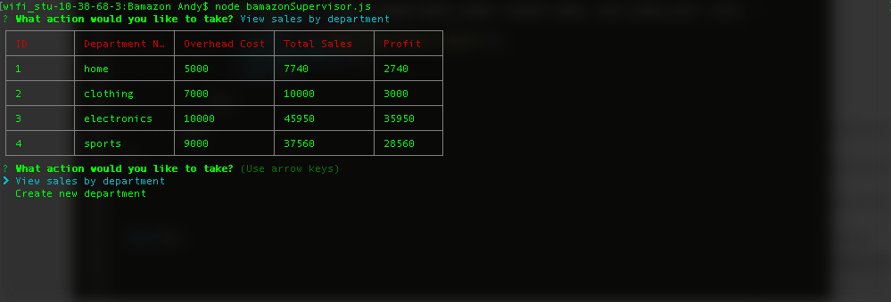
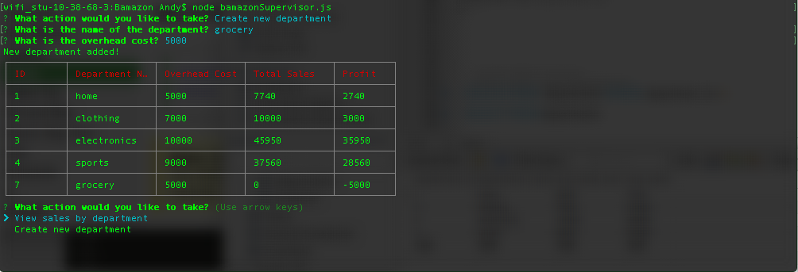

# Bamazon

  Bamazon has three node apps.
  
 
* bamazonCustomer.js
* bamazonManager.js
* bamazonSupervisor.js

### bamazonCustomer.js

  when you open bamazonCustomer.js will be shown a list of all available products, their ID, and their price.
  
  ...

...

You can then select an item ID and amount you would like to order. The result will show-

* Total cost of purchase
* Total quantity of that product remaining
* total sales of that product
* total sales of the department that item is in

  ...

...

If the amount requested is more than is in stock, you will be rejected and advised the remaining stock of that item.

  ...

...

### bamazonManager.js

bamazonManager.js will give you four options to choose from

* View products for sale
* View low inventory
* Add to inventory
* Add new product
  ...

...

##### "View products for sale" 
will show you a list of the products by ID, name, price, and quantity

  ...

...

##### "View low inventory" 
will show you a list with the same information, but only for products with a qantity of 5 or less.

  ...

...

##### "Add to inventory" 
will allow you to select the product by ID and add to the inventory.

  ...

...
  ...

...

##### "Add new product"
will allow you to add a new product to your table

You will first add the name and select the department

  ...

...

You will then choose the price and the quantity and the updated table will be displayed

  ...

...

### bamazonsupervisor.js

The supervisor view allows you to view department statistics and add new departments

It begins by asking what action you would like to take
  ...

...

If "view sales by department" is chosen, it will give all information in the SQL table, plus add a new table which calculates the profit.
  ...

...

If "Create new department" is chosen , you will be prompted for the name and overhead cost of the department. The total sales will be set to 0.It will the display the updated table of all departments.

  ...

...

