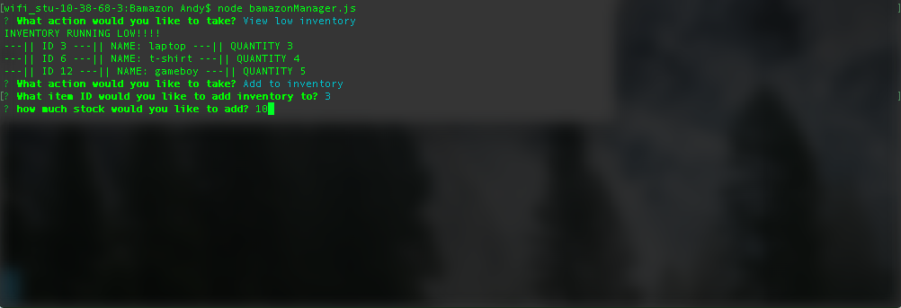

# Bamazon

  Bamazon has three node apps.
  
 
* bamazonCustomer.js
* bamazonManager.js
* bamazonSupervisor.js

### bamazonCustomer.js

  when you open bamazonCustomer.js will be shown a list of all available products, their ID, and their price.
  
  ...

...

You can then select an item ID and amount you would like to order. The total price and stock remaining will show. The inquirer will then start over.

  ...

...

If the amount requested is more than is in stock, you will be rejected and advised the remaining stock of that item.

  ...

...

### bamazonManager.js

bamazonManager.js will give you four options to choose from

* View products for sale
* View low inventory
* Add to inventory
* Add new product
  ...

...

##### "View products for sale" 
will show you a list of the products by ID, name, price, and quantity

  ...

...

##### "View low inventory" 
will show you a list with the same information, but only for products with a qantity of 5 or less.

  ...

...

##### "Add to inventory" 
will allow you to select the product by ID and add to the inventory.

  ...

...
  ...

...

##### "Add new product"
will allow you to add a new product to your table

You will first add the name and select the department

  ...

...

You will then choose the price and the quantity and the updated table will be displayed

  ...

...

